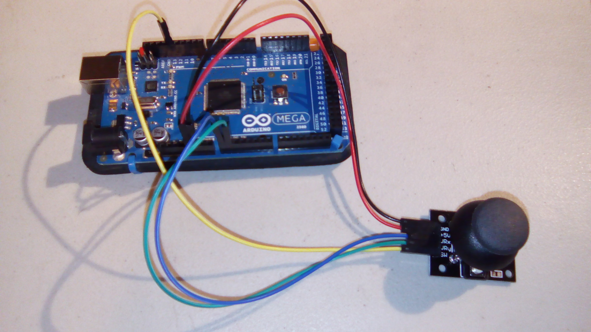
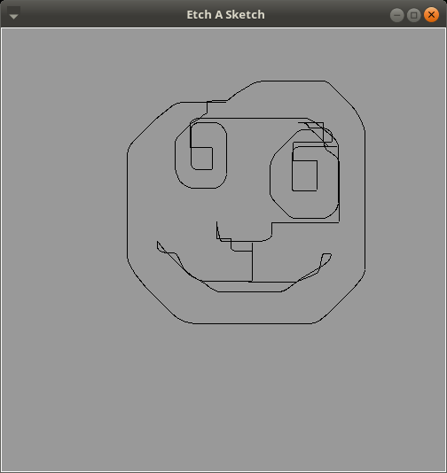

#Etch-A-Sketch

This program uses a joystick to draw, like with an etch a sketch. This features all the joys of your childhood toy, such as 

-   Difficulty drawing anything but vertical/horizontal lines
-   Continuous lines for *everything*, making your drawing look a bit creepy
-   Not resetting the "pen" when the picture is reset
-   Inability to save the drawing except with a picture

The best part is that these features required no extra programming!

## Software

This uses both an arduino and python. The hardware connections are discussed below.

On the arduino side, load the program joystick.ino (in the joystick folder) into the arduino. I used an arduino mega.

On the python side, you will need the tk GUI library. The program will let you know if there's an issue importing.

When you start the program, you'll need to tell the python program where to find the arduino. For me, that's at `/dev/ttyACM0` or something similar. You may have to change the permissions for accessing the port though.

To draw, move the joystick around. To clear the screen, press the joystick. This will leave the draw point where it is though.

Don't hold the joystick in your hand; this can short the "clear screen" button. 

##Hardware
This uses the following wires:
- Red: 5V to +5V of joystick
- Black: GND to GND of joystick
- Blue: A0 (analog in) to VRx
- Green: A1 (analog in) to VRy
- Yellow: pin 13 to SW

With the joystick pointing towards you, the pins from left to right are GND, +5V, VRx, VRy, and SW.

Wiring:

## Results

Picture quality similar to that of an etch a sketch. It's harder than it looks, ok?

